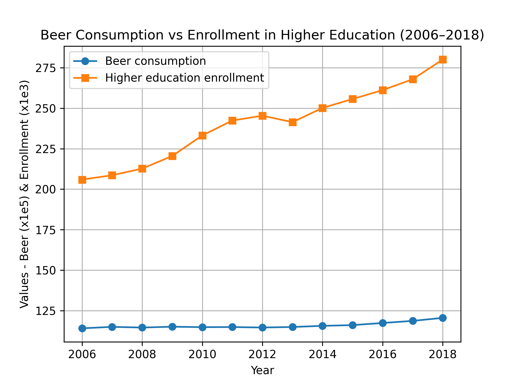

- Student Name - Pranav Bali
- Student ID: 16076591

## Key papers
## Fantastic Yeasts and Where to Find Them: The Hidden Diversity of Dimorphic Fungal Pathogens (2019)
**Authors:** Marley C.C. Van Dyke, Marcus M. Teixeira, Bridget M. Barker  
**Journal:** *Current Opinion in Microbiology*  
 - MCC Van Dyke et al., 2019
 - JT Harvey, Applied Ergonomics, 2002
 - DW Ziegler et al., 2005

There is a good correlation between the number of enrolled students and beer consumption as we can see that increasing enrolment, increased the beer consumption by a lot.
